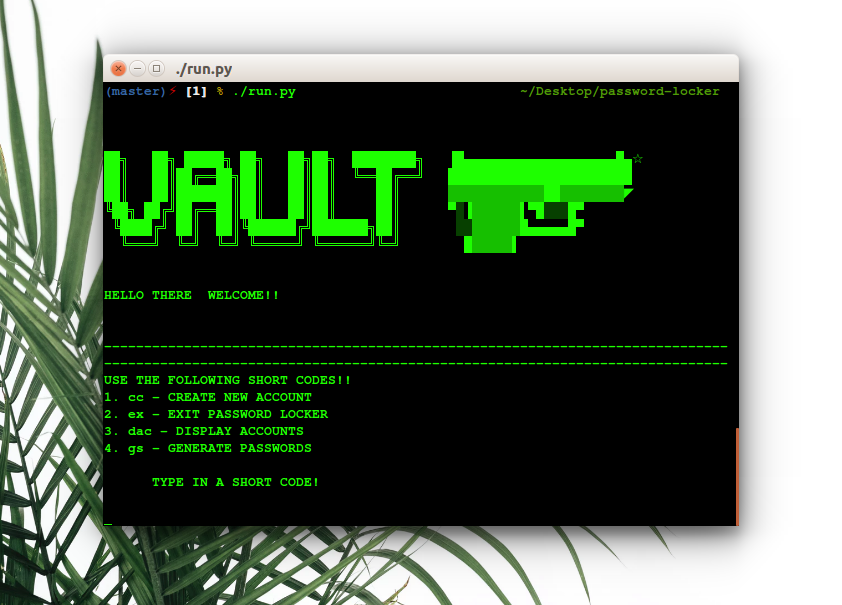
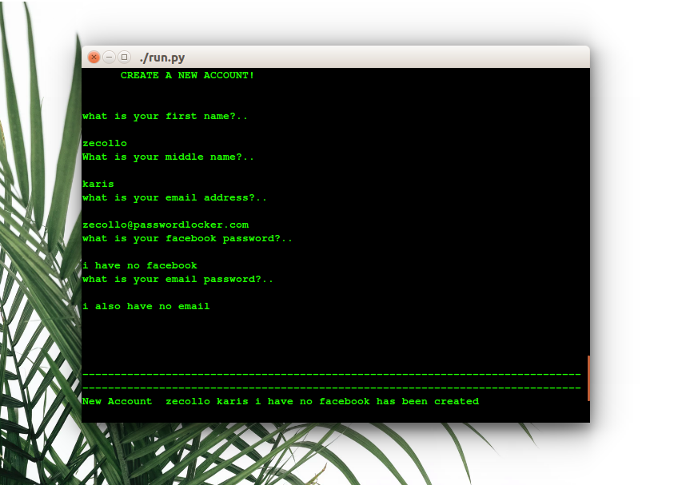
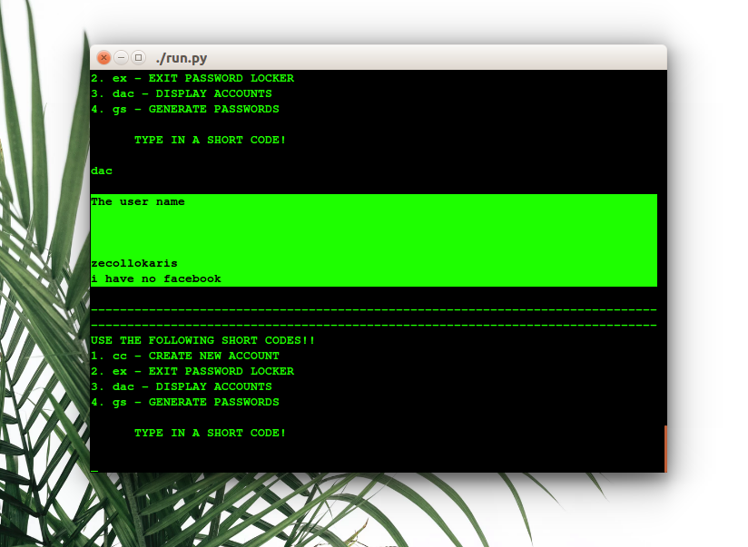
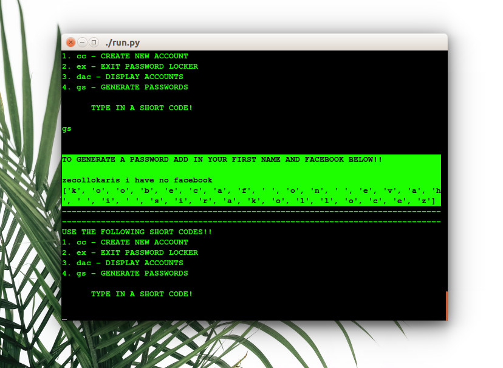
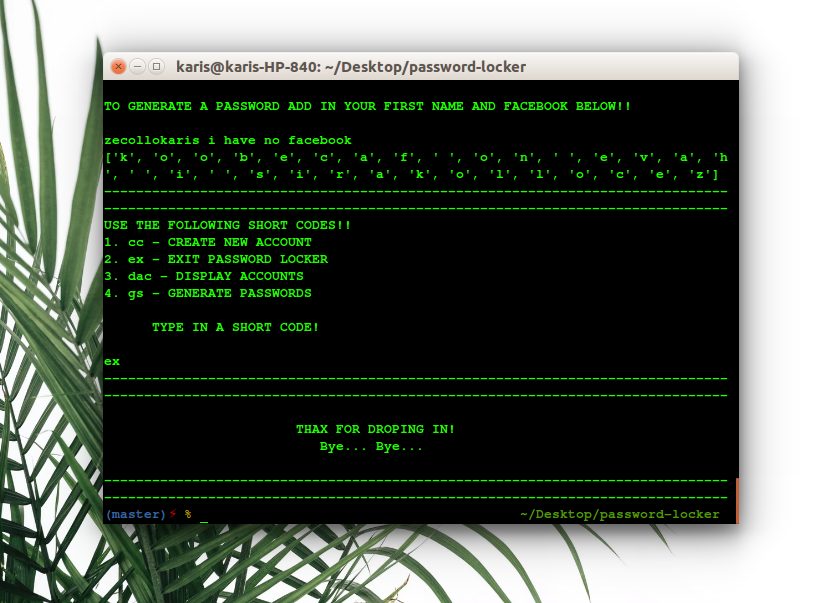

# Password-Locker :closed_lock_with_key:

Having trouble in creating a new password or trying to remember new passwords this reposirory gutch u!! :wink:

This is a simple shell application that allows a user to store their profile credentials and also generate a strong password.

## Authors

* **Collins Kariuki**

## Getting Started

**These Simple Instructions will get you a copy of the application running on your terminal.**

1. You need to get into the **Project Repository.**

Link:-> ```https://github.com/zecollokaris/password-locker```

2. **Clone the project.**

3. **get into project** folder (cd into project).

4. If you have all the Pre-requisites you can **run the application.**

## DISPLAY


---

---

---

---

---

### Prerequisites

**What things you need to install the application and how to install them.**

```
Python3.6
```
## Installation

To Install **python 3.6** on terminal execute

```
apt-get install python3.6
```

```
apt-get install pip3
```

## Running the application

1. Navigate into the cloned folder using terminal and **enter command** `./run.py` to run the app.
The app will open on terminal

2. Follow and answer the prompts to use the application.

3. Cheers :beers: Enjoy the Application. :smirk:

## Built With

* [Python3.6](https://docs.python.org/3/)

* [Ascii Text](http://patorjk.com/software/taag/#p=display&f=Graffiti&t=Type%20Something%20)


## Support & Contact

- Mobile number: (+254) 798731203

- Email Address: collo.kariss@gmail.com

- github-username: zecollokaris

## License

This project is licensed under the **MIT License** - see the [LICENSE](LICENSE.md) file for details

